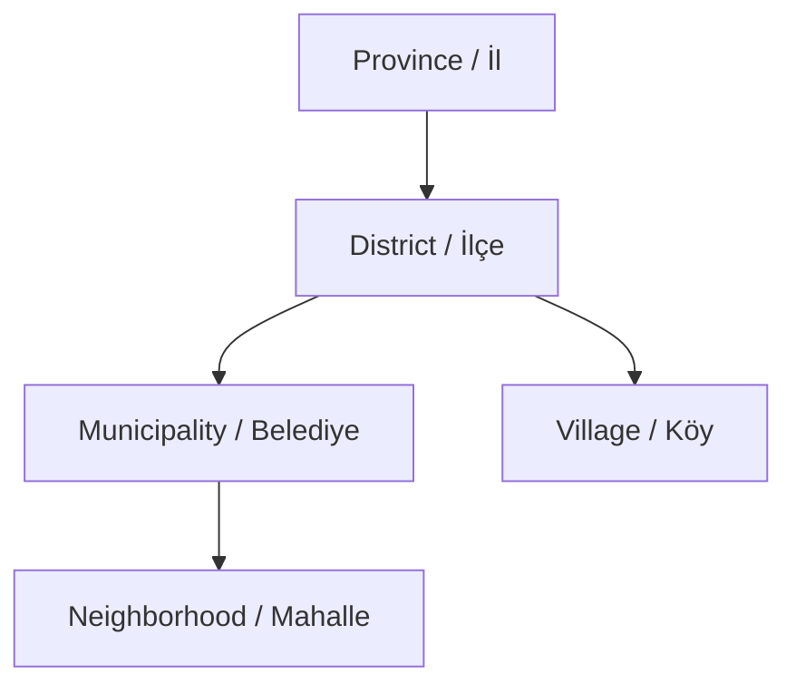

# Administrative Structure

This page explains how Türkiye's administrative hierarchy is represented in TurkiyeAPI v2. The API does not try to describe every legal detail of local administration; it provides a practical data model for navigating provinces, districts, municipalities, neighborhoods, and villages.

## Hierarchy

At a high level, the API follows this structure:

```text
Province
└─ District
   ├─ Municipality
   │  └─ Neighborhood
   └─ Village
```

The most common lookup flow is:

```text
Province -> District -> Municipality -> Neighborhood
```

For rural settlements, the flow is:

```text
Province -> District -> Village
```

[Mermaid diagram](https://mermaid.ai/d/5bdb999f-913e-4e61-998a-2dd797f4af2c) visualizing the hierarchy:



## Provinces

Provinces are the top-level units. Each province can have districts, municipalities, neighborhoods, and villages under it.

Useful province fields include:

- `isMetropolitan`, which marks metropolitan provinces.
- `region`, which gives the geographical region in Turkish and English.
- `stats`, which summarizes child record counts.
- `coordinates`, which gives province-level latitude and longitude.

::: tip
If a province's `isMetropolitan` value is `true`, it will not have any villages under it.
:::

## Districts

Districts are subdivisions of provinces. Every district has a `provinceId` field.

District endpoints are useful when you already know the province and need the next level:

```http
GET /v2/provinces/34/districts
```

or:

```http
GET /v2/districts?provinceId=34
```

Both patterns can be useful. The nested path reads naturally, while the collection query is convenient when combining filters and selected fields.

## Municipalities

Municipalities are local government records connected to both a province and a district.

The `type` field explains the municipality's role:

- `province_center`
- `district_center`
- `town`

Use municipality records when you need to distinguish the administrative district from the local government unit serving neighborhoods.

## Neighborhoods

Neighborhoods are connected to a province, district, and municipality. They are the most detailed urban settlement level in the API.

For a municipality-based address picker, the typical request is:

```http
GET /v2/neighborhoods?municipalityId=937
```

You can also use the nested endpoint:

```http
GET /v2/municipalities/937/neighborhoods
```

## Villages

Villages are connected to a province and district. They do not have a `municipalityId`.

For district-level rural settlement lists, use:

```http
GET /v2/villages?districtId=1105
```

or:

```http
GET /v2/districts/1105/villages
```

## Counts and Metadata

The `/v2/meta` endpoint returns current record counts for each resource type:

```http
GET /v2/meta
```

The response includes counts for provinces, districts, municipalities, neighborhoods, and villages, along with the dataset version and update date.

Individual province and district records also include `stats` fields, which are useful for showing counts before fetching child collections.
