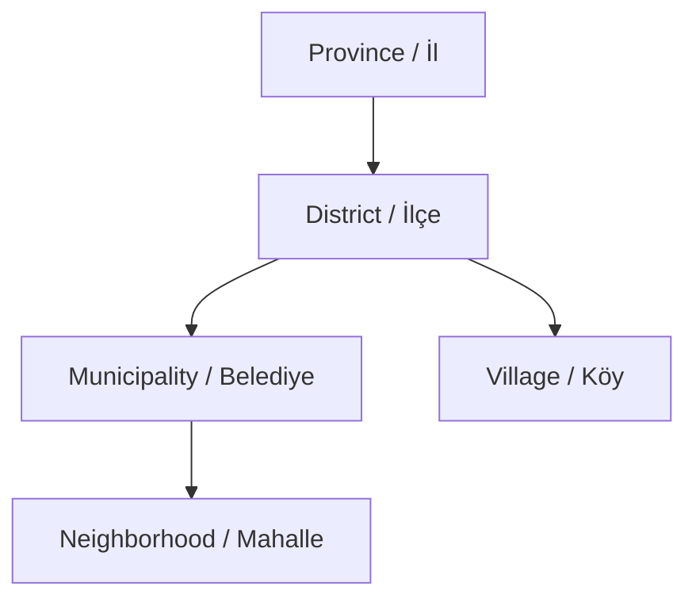

# İdari Yapı

Bu sayfa Türkiye'nin idari hiyerarşisinin TurkiyeAPI v2 içinde nasıl temsil edildiğini açıklar. API, yerel yönetim mevzuatının tüm ayrıntılarını modellemek yerine; il, ilçe, belediye, mahalle ve köy arasında gezinmeye uygun pratik bir veri modeli sunar.

## Hiyerarşi

Genel yapı şu şekildedir:

```text
İl
└─ İlçe
   ├─ Belediye
   │  └─ Mahalle
   └─ Köy
```

En yaygın lookup akışı:

```text
İl -> İlçe -> Belediye -> Mahalle
```

Kırsal yerleşimler için akış:

```text
İl -> İlçe -> Köy
```

[Mermaid diyagramı](https://mermaid.ai/d/5bdb999f-913e-4e61-998a-2dd797f4af2c) ile görselleştirilmiş hiyerarşi:



## İller

İller en üst seviye birimlerdir. Her ilin altında ilçeler, belediyeler, mahalleler ve köyler bulunabilir.

Kullanışlı il alanları:

- `isMetropolitan`, ilin büyükşehir olup olmadığını belirtir.
- `region`, coğrafi bölgeyi Türkçe ve İngilizce verir.
- `stats`, child kayıt sayılarını özetler.
- `coordinates`, il seviyesinde enlem ve boylam verir.

::: tip
Eğer bir ilin `isMetropolitan` değeri `true` ise, o ile bağlı köyler olmayacaktır.
:::

## İlçeler

İlçeler illerin alt birimleridir. Her ilçede `provinceId` alanı vardır.

İli biliyorsanız ve bir sonraki seviyeyi yüklemek istiyorsanız ilçe endpoint'leri kullanışlıdır:

```http
GET /v2/provinces/34/districts
```

veya:

```http
GET /v2/districts?provinceId=34
```

İki kullanım da geçerlidir. Nested path okunabilirlik sağlar; collection query ise filtre, sıralama ve seçili alanlarla birlikte kullanımda pratiktir.

## Belediyeler

Belediyeler hem ile hem ilçeye bağlı yerel yönetim kayıtlarıdır.

`type` alanı belediyenin rolünü açıklar:

- `province_center`
- `district_center`
- `town`

İdari ilçe ile mahallelere hizmet eden yerel yönetim birimini ayırmanız gerektiğinde belediye kayıtlarını kullanın.

## Mahalleler

Mahalleler ile, ilçeye ve belediyeye bağlıdır. API'deki en detaylı kentsel yerleşim seviyesidir.

Belediye bazlı adres seçici için tipik istek:

```http
GET /v2/neighborhoods?municipalityId=937
```

Nested endpoint de kullanılabilir:

```http
GET /v2/municipalities/937/neighborhoods
```

## Köyler

Köyler ile ve ilçeye bağlıdır. `municipalityId` alanları yoktur.

İlçe seviyesinde köy listeleri için:

```http
GET /v2/villages?districtId=1105
```

veya:

```http
GET /v2/districts/1105/villages
```

## Sayılar ve Metadata

`/v2/meta` endpoint'i her kaynak tipi için güncel kayıt sayılarını döndürür:

```http
GET /v2/meta
```

Yanıtta il, ilçe, belediye, mahalle ve köy sayıları ile birlikte veri seti sürümü ve güncelleme tarihi bulunur.

İl ve ilçe kayıtları ayrıca `stats` alanları içerir. Bu alanlar child koleksiyonları çekmeden önce sayıları göstermek için kullanışlıdır.
